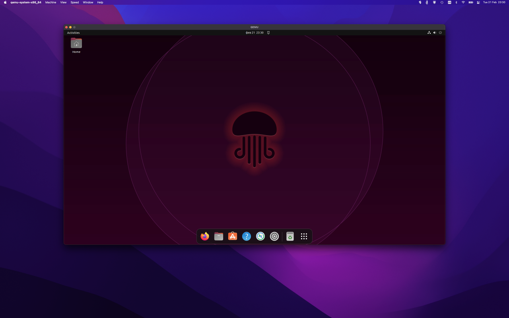

# Tutorial

This is a quick run-through on how to create and run a virtual Ubuntu 20.04 desktop machine on macOS Catalina using either QEMU 5.1 via Homebrew or QEMU 5.0 via MacPorts. This guide assumes you have familiarity with the command-line, virtual machines, ssh, port-forwarding, and graphical Linux installers.

## Main

### 1. Install either Homebrew or MacPorts according to their installation instructions

### 2. Pull down the qemu package

#### Homebrew

        brew install qemu

#### MacPorts

        sudo port install qemu

### 3. Create a 60 Gigabyte image to use as the VMs hard disk

    qemu-img create -f qcow2 ubuntu2004.qcow2 60G

> #### output

>     Formatting 'ubuntu2004.qcow2', fmt=qcow2 size=64424509440 cluster_size=65536 lazy_refcounts=off refcount_bits=16

### 4. Download the Ubuntu 20.04 desktop installer

    curl -L -o ubuntu-20.04.1-desktop-amd64.iso https://releases.ubuntu.com/20.04/ubuntu-20.04.1-desktop-amd64.iso

> #### output

>     % Total    % Received % Xferd  Average Speed   Time    Time     Time  Current
>                                     Dload  Upload   Total   Spent    Left  Speed
>     100 2656M  100 2656M    0     0  8070k      0  0:05:37  0:05:37 --:--:-- 7717k

### 5. Verify the ISO by following Canonical’s detailed tutorial

### 6. Boot the ISO installer

    $ qemu-system-x86_64 \
    -accel hvf \
    -cpu host,-rtdscp \
    -smp 2 \
    -m 4G \
    -usb \
    -device usb-tablet \
    -vga virtio \
    -display default,show-cursor=on \
    -device virtio-net,netdev=vmnic -netdev user,id=vmnic \
    -audiodev coreaudio,id=coreaudio \
    -device ich9-intel-hda -device hda-output,audiodev=coreaudio \
    -cdrom ubuntu-20.04.1-desktop-amd64.iso \
    -drive file=ubuntu2004.qcow2,if=virtio
    -cpu host

That’s a long command-line, so I’ve broken it down option-by-option below. For more details, refer to the QEMU System Emulation User’s Guide.

- **-accel hvf** <br>
A ccelerate the machine by taking advantage of the macOS hypervisor, hvf. kvm is available for Linux and whpx for Windows.

- **-cpu host,-rtdscp** <br>
Due to this bug in Apple’s Hypervisor framework, the RTDSCP virtualization feature on my mac’s CPU needs to be disabled. The host keyword enables CPU passthrough, while the -rtdscp option disables the troublesome RTDSCP feature. If you experience issues due to host passthrough, you can use the default cpu option, qemu64, which emulates the CPU instead of passing through.

- **-smp 2** <br>
Allocate two threads for the VM.

- **-m 4G** <br>
Allocate 4 GB of RAM for the VM.

- **-usb** <br>
Enable a USB bus.

- **-device usb-tablet** <br>
Avoid having to grab the mouse, making it easier to switch between interacting with the VM and the host.

- **-vga virtio** <br>
Use the virtio display card.

- **-display default,show-cursor=on** <br>
Don’t hide the cursor.

- **-device virtio-net,netdev=vmnic -netdev user,id=vmnic** <br>
Pass-through networking with virtio.[1]

- **-audiodev coreaudio,id=coreaudio** <br>
Add a backend audio driver for Apple’s Core Audio.

- **-device ich9-intel-hda -device hda-output,audiodev=coreaudio** <br>
Add an audio bus and an output device utilizing the coreaudio driver created previously.This enables audio output from the guest.

- **-cdrom ubuntu-20.04.1-desktop-amd64.iso** <br>
Attach the Boot ISO in the VM as a CD.

- **-drive file=ubuntu2004.qcow2,if=virtio** <br>
Attach the hard-disk created earlier, using virtio drivers.
<br>
<br>
    The virtio options effectively pass-through directly to the hardware instead of emulating physical devices. Skipping this layer of emulation can significantly improve VM performance.

### 7. Complete the installation in the virtual machine window which should appear after starting the VM.

### 8. After the installation, run the virtual machine from the hard disk.

    $ qemu-system-x86_64 \
    -accel hvf \
    -cpu host,-rtdscp \
    -smp 2 \
    -m 4G \
    -device usb-tablet \
    -vga virtio \
    -display default,show-cursor=on \
    -usb \
    -device virtio-net,netdev=vmnic -netdev user,id=vmnic \
    -audiodev coreaudio,id=coreaudio \
    -device ich9-intel-hda -device hda-output,audiodev=coreaudio \
    -drive file=ubuntu2004.qcow2,if=virtio
    -cpu host
<br>

## SSH

It’s a small step away to run the virtual machine headless and access it through ssh.

### 1. Run the virtual machine headless, forwarding ssh over port 9001 on the host.

    ```
    $ qemu-system-x86_64 \
    -accel hvf \
    -cpu host,-rtdscp \
    -smp 2 \
    -m 4G \
    -device usb-tablet \
    -usb \
    -nographic \
    -device virtio-net,netdev=vmnic \
    -netdev user,id=vmnic,hostfwd=tcp:127.0.0.1:9001-:22 \
    -drive file=ubuntu2004.qcow2,if=virtio
    ```

### 2. Enable SSH in the guest OS.

### 3. ssh into the machine from the host.

    ```
    ssh -p 9001 localhost
    ```

## Conclusion

You should now be able to easily build and run Linux desktop virtual machines with QEMU on macOS.
